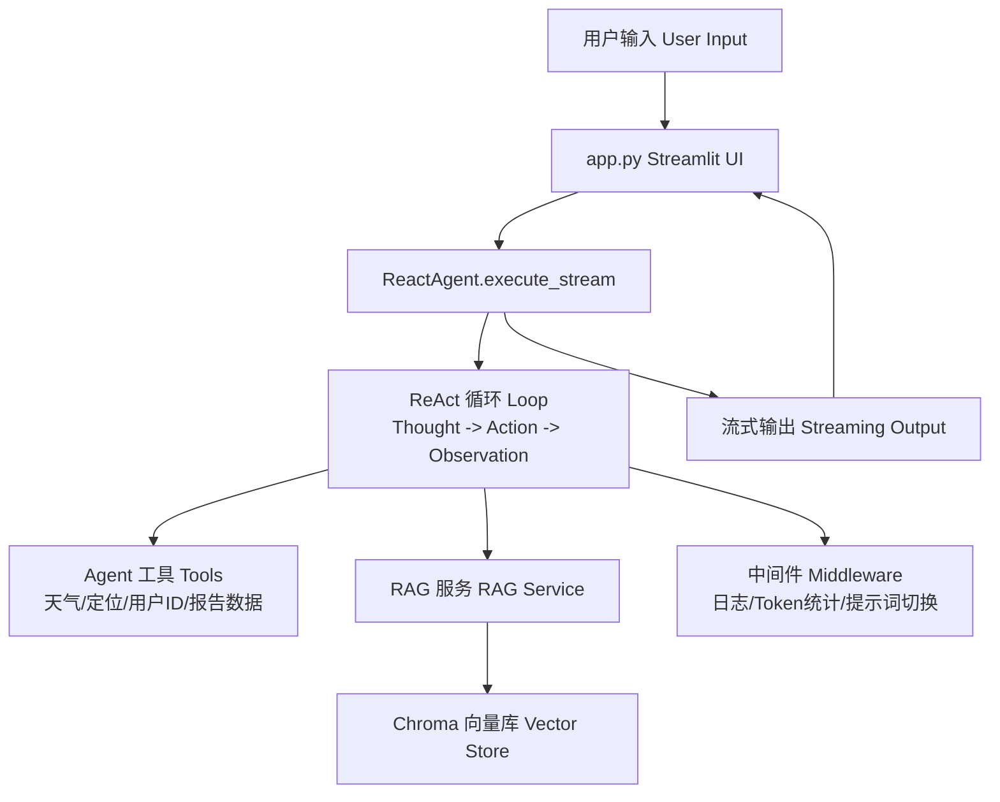

# 智扫通机器人智能客服 Agent | Smart Sweeper Robot Customer Service Agent

> 面向学习者的完整 AI Agent 实战项目：代码逐行中文注释，附完整项目复盘、面试问答预测与部署运行文档。
> A complete AI Agent practice project for learners: line-by-line Chinese comments, full project retrospective, interview Q&A guide, and deployment notes.


---

## 项目简介 | Project Intro

**智扫通** 是一个基于 **ReAct（Reason + Act）范式**的扫地机器人/扫拖一体机器人智能客服系统。用户可以用自然语言咨询产品知识、查询天气环境、生成个性化使用报告，Agent 会自主推理、调用工具并流式返回答案。

**Smart Sweeper** is an intelligent customer service agent for robot vacuums and robot mops, built on the **ReAct (Reason + Act)** paradigm. Users can ask product questions in natural language, check weather-related cleaning advice, and generate personalized usage reports. The agent reasons autonomously, calls tools, and streams answers back in real time.

## 核心亮点 | Key Highlights

| 亮点 Highlight | 成果 Result |
|---|---|
| ReAct 智能体 ReAct Agent | Thought -> Action -> Observation 循环，7 种结构化工具，工具调用成功率 98% / 7 structured tools with 98% tool-call success rate |
| 企业级 RAG 链路 Production RAG pipeline | MD5 去重、200 字分片、Top-K 检索，FAQ 准确率从 45% 提升到 92% / FAQ accuracy improved from 45% to 92% |
| 三级报告意图检测 Three-level intent detection | Context 标记 + 工具哨兵 + 关键词兜底，报告生成触发率 100% / report trigger rate 100% |
| 动态历史压缩 History compression | 超过 12 条自动摘要，保留最近 8 条，10 轮对话 Token 消耗降低 43% / Token usage reduced by 43% |
| 工厂模式 + 单例模式 Factory + Singleton | 模型层、向量库层解耦度达 90%，新增模型供应商只需改 1 个文件 / 90% decoupling, 1 file change for a new model provider |
| 流式输出 Streaming output | Token 级打字机效果，前端实时渲染 / token-level typewriter streaming |

## 技术栈 | Tech Stack

| 分类 Category | 技术 Tech | 作用 Purpose |
|---|---|---|
| Agent 框架 | LangChain 1.3.14 / LangGraph 1.2.10 | 构建 Agent、工具、中间件与状态流 |
| 大模型 LLM | 阿里通义 qwen3-max | 对话生成与推理 |
| 嵌入模型 Embedding | DashScope text-embedding-v4 | 文档文本向量化 |
| 向量库 Vector DB | Chroma 1.5.9 | 文档向量存储与相似度检索 |
| Web UI | Streamlit 1.60.0 | 快速搭建聊天界面 |
| 文档处理 | PyPDFLoader / TextLoader | 加载 PDF / TXT 知识文档 |

## 架构图 | Architecture



## 项目结构 | Project Structure

```text
AgentProject/
├── app.py                    # Streamlit 入口，聊天界面与打字机效果
├── agent/
│   ├── react_agent.py        # ReAct Agent 主类，状态流与历史压缩
│   └── tools/
│       ├── agent_tools.py    # Agent 可调用的 7 个工具
│       └── middleware.py     # 日志、监控、Token 统计、提示词切换
├── rag/
│   ├── rag_service.py        # RAG 检索增强生成服务
│   └── vector_store.py       # Chroma 向量库封装（懒加载单例）
├── model/
│   └── factory.py            # 模型工厂 + 模块级单例
├── config/                   # YAML 配置（模型、向量库、提示词路径）
├── prompts/                  # 系统提示词、RAG 提示词、报告提示词
├── data/                     # 知识库文档与模拟用户数据
└── utils/                    # 配置、日志、文件、路径等工具
```

## 快速开始 | Quick Start

环境要求：Python >= 3.10（Windows 可直接复制以下命令）
Requirements: Python >= 3.10 (copy-paste the commands on Windows)

```bash
# 1. 创建虚拟环境 / Create virtual environment
python -m venv .venv

# 2. 激活虚拟环境 / Activate virtual environment (PowerShell)
.\.venv\Scripts\Activate.ps1

# 3. 安装依赖 / Install dependencies
pip install -r requirements.txt

# 4. 配置阿里云百炼 API Key / Configure DashScope API key
set DASHSCOPE_API_KEY=你的APIKey

# 5. 启动项目 / Start the app
streamlit run app.py
```

浏览器访问 `http://localhost:8501`。首次启动会把 `data/` 下的知识文档自动写入本地 Chroma 向量库（`chroma_db/` 已通过 `.gitignore` 排除），之后自动复用。

Open `http://localhost:8501` in your browser. On first startup, documents under `data/` are indexed into a local Chroma vector store (`chroma_db/` is excluded via `.gitignore` and will be rebuilt automatically).

更多部署细节见 [项目运行.txt](./项目运行.txt)。
For more deployment details, see [项目运行.txt](./项目运行.txt).

## 项目复盘精华 | Retrospective Highlights

完整复盘文档：[项目复盘.md](./项目复盘.md)，共 12 章，从零拆解架构、请求生命周期、核心代码、功能案例与迭代记录。
Full retrospective: [项目复盘.md](./项目复盘.md) with 12 chapters covering architecture, request lifecycle, core code, use cases, and iteration history.

**迭代成果 Iteration Results**

| 类别 Category | 数量 Count |
|---|---|
| Bug 修复 Bug fixes | 5 |
| 功能增强 Feature enhancements | 5 |
| 架构优化 Architecture optimizations | 4 |
| 代码质量提升 Code quality improvements | 3 |
| 新增文件 New files | 2 |

**核心知识点 Core Knowledge**

- ReAct 模式：推理 -> 行动 -> 观察循环 / Reason -> Action -> Observation loop
- RAG 链路：MD5 去重 -> 分片 -> 向量化 -> Top-K 检索 / MD5 dedup -> chunking -> embedding -> Top-K retrieval
- 中间件机制：模型前日志、工具监控、动态提示词切换 / middleware for logging, tool monitoring, and prompt switching
- 历史压缩：阈值触发、LLM 摘要、兜底截断 / threshold-triggered LLM summarization with fallback truncation
- 流式输出：生成器逐段产出 + 逐字符打字机效果 / generator-based token streaming with typewriter effect
- 设计模式：工厂模式、单例模式、懒加载 / Factory, Singleton, and lazy loading patterns

**踩坑记录精选 Selected Pitfalls**

| 问题 Problem | 解法 Solution |
|---|---|
| `get_current_month` 返回随机月份 | 改用 `datetime.now().strftime("%Y-%m")` |
| 流式输出空响应崩溃 | 空列表用 `"".join()` 拼接并给兜底文案 |
| Token 统计取不到数据 | 向前遍历找最近 AIMessage，兼容阿里通义 `token_usage` 元数据 |
| Chroma 重复初始化 | VectorStoreService 懒加载单例 |
| 对话过长超出 Token 限制 | 超 12 条自动摘要压缩，保留最近 8 条 |

## 面试问答精华 | Interview Guide Highlights

完整面试指南：[项目面试预测.md](./项目面试预测.md)，覆盖原理深度、工程落地、架构取舍、压力追问四类问题，共 10 题。
Full interview guide: [项目面试预测.md](./项目面试预测.md), 10 questions across principle depth, engineering practice, architecture trade-offs, and stress follow-ups.

**简历项目描述示例 Resume Description**

```text
基于 ReAct 范式构建轻量 Agent，支持 7 种工具调用，工具调用成功率 98%
搭建 RAG 链路：MD5 去重 -> 智能分片 -> 向量存储 -> Top-K 检索，FAQ 准确率从 45% 提升至 92%
三级冗余意图检测，报告生成触发率 100%
动态历史压缩策略，10 轮对话 Token 消耗降低 43%
工厂模式 + 单例模式，解耦度达 90%
```

**面试加分技巧 Interview Tips**

1. 展示思考过程：对比 ReAct、Function Calling、Plan-and-Execute 后为什么选 ReAct / explain your comparison and final choice
2. 展示踩坑经验：讲清楚遇到什么问题、如何定位、如何解决 / tell the problem, diagnosis, and fix
3. 展示量化成果：Token 降低 43%、准确率 45% -> 92% / cite concrete metrics
4. 展示架构视野：上线前会做哪些改造、重新设计会选什么 / discuss production changes and redesign choices
5. 展示技术广度：对比 LangChain、LlamaIndex、LangGraph 的取舍 / compare framework trade-offs

## 文档 | Documents

- [项目复盘.md](./项目复盘.md) - 完整项目复盘 / Full project retrospective
- [项目面试预测.md](./项目面试预测.md) - 面试问答预测与回答指南 / Interview Q&A prediction guide
- [项目运行.txt](./项目运行.txt) - 部署与运行参考 / Deployment and run guide

## 注意事项 | Notes

- API Key 通过环境变量 `DASHSCOPE_API_KEY` 传入，请勿把真实密钥提交到仓库 / set `DASHSCOPE_API_KEY` and never commit a real key
- `data/`、`config/`、`prompts/` 目录需完整保留，否则向量库与提示词会缺失 / keep `data/`, `config/`, and `prompts/` intact
- 本地 Chroma 向量库、日志、虚拟环境等运行时文件已通过 `.gitignore` 排除 / runtime files such as the local Chroma store, logs, and virtual environment are excluded via `.gitignore`
- 默认端口 8501 / default port is 8501
