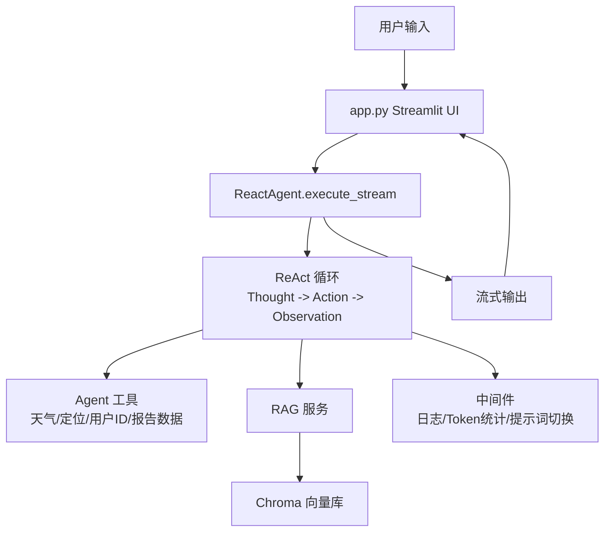

# 智扫通机器人智能客服 Agent

> 面向学习者的完整 AI Agent 实战项目：代码逐行中文注释，附完整项目复盘、面试问答预测与部署运行文档。

**中文** | [English](./README_EN.md)


---

## 项目简介

**智扫通** 是一个基于 **ReAct（Reason + Act）范式**的扫地机器人/扫拖一体机器人智能客服系统。用户可以用自然语言咨询产品知识、查询天气环境、生成个性化使用报告，Agent 会自主推理、调用工具并流式返回答案。

## 核心亮点

| 亮点 | 成果 |
|---|---|
| ReAct 智能体 | Thought -> Action -> Observation 循环，7 种结构化工具，工具调用成功率 98% |
| 企业级 RAG 链路 | MD5 去重、200 字分片、Top-K 检索，FAQ 准确率从 45% 提升到 92% |
| 三级报告意图检测 | Context 标记 + 工具哨兵 + 关键词兜底，报告生成触发率 100% |
| 动态历史压缩 | 超过 12 条自动摘要，保留最近 8 条，10 轮对话 Token 消耗降低 43% |
| 工厂模式 + 单例模式 | 模型层、向量库层解耦度达 90%，新增模型供应商只需改 1 个文件 |
| 流式输出 | Token 级打字机效果，前端实时渲染 |

## 技术栈

| 分类 | 技术 | 作用 |
|---|---|---|
| Agent 框架 | LangChain 1.3.14 / LangGraph 1.2.10 | 构建 Agent、工具、中间件与状态流 |
| 大模型 | 阿里通义 qwen3-max | 对话生成与推理 |
| 嵌入模型 | DashScope text-embedding-v4 | 文档文本向量化 |
| 向量库 | Chroma 1.5.9 | 文档向量存储与相似度检索 |
| Web UI | Streamlit 1.60.0 | 快速搭建聊天界面 |
| 文档处理 | PyPDFLoader / TextLoader | 加载 PDF / TXT 知识文档 |

## 架构图



## 项目结构

```text
AgentProject/
├── app.py                    # Streamlit 入口，聊天界面与打字机效果
├── agent/
│   ├── react_agent.py        # ReAct Agent 主类，状态流与历史压缩
│   └── tools/
│       ├── agent_tools.py    # Agent 可调用的 7 个工具
│       └── middleware.py     # 日志、监控、Token 统计、提示词切换
├── rag/
│   ├── rag_service.py        # RAG 检索增强生成服务
│   └── vector_store.py       # Chroma 向量库封装（懒加载单例）
├── model/
│   └── factory.py            # 模型工厂 + 模块级单例
├── config/                   # YAML 配置（模型、向量库、提示词路径）
├── prompts/                  # 系统提示词、RAG 提示词、报告提示词
├── data/                     # 知识库文档与模拟用户数据
└── utils/                    # 配置、日志、文件、路径等工具
```

## 快速开始

环境要求：Python >= 3.10（Windows 可直接复制以下命令）

```bash
# 1. 创建虚拟环境
python -m venv .venv

# 2. 激活虚拟环境（PowerShell）
.\.venv\Scripts\Activate.ps1

# 3. 安装依赖
pip install -r requirements.txt

# 4. 配置阿里云百炼 API Key
set DASHSCOPE_API_KEY=你的APIKey

# 5. 启动项目
streamlit run app.py
```

浏览器访问 `http://localhost:8501`。首次启动会把 `data/` 下的知识文档自动写入本地 Chroma 向量库（`chroma_db/` 已通过 `.gitignore` 排除），之后自动复用。

更多部署细节见 [项目运行](./项目运行.txt)。

## 项目复盘精华

完整复盘文档：[项目复盘](./项目复盘.md)，共 12 章，从零拆解架构、请求生命周期、核心代码、功能案例与迭代记录。

### 迭代成果

| 类别 | 数量 |
|---|---|
| Bug 修复 | 5 |
| 功能增强 | 5 |
| 架构优化 | 4 |
| 代码质量提升 | 3 |
| 新增文件 | 2 |

### 核心知识点

- ReAct 模式：推理 -> 行动 -> 观察循环
- RAG 链路：MD5 去重 -> 分片 -> 向量化 -> Top-K 检索
- 中间件机制：模型前日志、工具监控、动态提示词切换
- 历史压缩：阈值触发、LLM 摘要、兜底截断
- 流式输出：生成器逐段产出 + 逐字符打字机效果
- 设计模式：工厂模式、单例模式、懒加载

### 踩坑记录精选

| 问题 | 解法 |
|---|---|
| `get_current_month` 返回随机月份 | 改用 `datetime.now().strftime("%Y-%m")` |
| 流式输出空响应崩溃 | 空列表用 `"".join()` 拼接并给兜底文案 |
| Token 统计取不到数据 | 向前遍历找最近 AIMessage，兼容阿里通义 `token_usage` 元数据 |
| Chroma 重复初始化 | VectorStoreService 懒加载单例 |
| 对话过长超出 Token 限制 | 超 12 条自动摘要压缩，保留最近 8 条 |

## 面试问答预测

完整面试指南：[项目面试预测](./项目面试预测.md)，覆盖原理深度、工程落地、架构取舍、压力追问四类问题，共 10 题。以下为三个完整问答。

### Q2：RAG 里的「检索」和「生成」是怎么衔接的？你用的是哪种架构？有没有考虑过其他方案？

RAG 的核心是把外部知识注入到 LLM 的上下文窗口里，避免 LLM 产生幻觉。本项目采用 **Naive RAG + 工具封装** 的架构，并对比过几种 RAG 变体：

| RAG 变体 | 架构 | 优点 | 缺点 | 适用场景 |
|---|---|---|---|---|
| Naive RAG | 检索 -> 拼接 -> 生成 | 实现简单、快速 | 检索质量影响大、上下文长度有限 | 简单知识库（产品 FAQ） |
| Advanced RAG | 检索 -> 重排序 -> 压缩 -> 生成 | 精度高、上下文利用率高 | 实现复杂、慢 | 复杂知识库（长文档） |
| Modular RAG | 路由 -> 检索 -> 生成（动态选择） | 灵活、可插拔 | 架构复杂 | 多场景混合 |

**选用 Naive RAG 的原因：**

1. 项目知识库是产品 FAQ（短文档，100-300 字），不需要复杂的重排序和压缩
2. 为了让 Agent 能自主触发 RAG（而不是硬编码），把 RAG 封装成工具 `rag_summarize`，模型按需动态调用

**项目里的 RAG 链路**（对应 `rag_service.py`）：

```python
def rag_summarize_tool(query: str) -> str:
    # Step1: 把用户问题转成向量
    query_vector = embed_model.embed_query(query)
    # Step2: 从 Chroma 检索 Top-K 最相似的文档
    results = vector_store.similarity_search_by_vector(query_vector, k=3)
    # Step3: 把检索到的文档拼接成参考资料
    context = "\n".join([doc.page_content for doc in results])
    # Step4: 用 RAG 提示词让模型结合参考资料生成回答
    prompt = rag_prompt.format(context=context, question=query)
    return llm.invoke(prompt).content
```

**可优化的方向（Advanced RAG）：**

1. HyDE（假设性文档嵌入）：让 LLM 先生成假设性答案，用它的向量检索，比直接用用户问题向量更准
2. 重排序（Rerank）：用 Cross-Encoder 重新排序检索结果，比简单的向量相似度更准
3. 上下文压缩：用 LLM 把检索到的长文档压缩成短片段，节省 Token

### Q3：你说的「历史压缩」具体怎么实现的？为什么不用滑动窗口或者向量检索记忆？

多轮对话历史压缩是 Agent 的核心痛点，我对比过三种主流方案，最终选 **LLM 摘要压缩**：

| 压缩方案 | 核心逻辑 | 优点 | 缺点 | 适用场景 |
|---|---|---|---|---|
| 滑动窗口 | 保留最近 N 轮对话，丢弃历史 | 简单、快 | 丢失早期上下文 | 短对话（<5 轮） |
| 向量检索记忆 | 历史消息存成向量，需要时检索 | 保留关键信息、节省 Token | 实现复杂、检索慢 | 长对话（>20 轮） |
| LLM 摘要压缩 | 用 LLM 把历史消息生成摘要替代原文 | 保留核心信息、Token 消耗低 | 依赖 LLM、可能丢失细节 | 中长对话（10-20 轮） |

**选用 LLM 摘要压缩的原因：**

1. 客服场景对话轮数中等（通常 10 轮以内），滑动窗口会丢信息，向量检索太重
2. LLM 摘要能把多轮对话的核心信息提取出来（比如之前问过的产品问题、提供的位置），比滑动窗口更智能

**项目里的实现细节**（对应 `react_agent.py` 的 `_maybe_compress` 方法）：

```python
def _maybe_compress(messages: list[dict]) -> list[dict]:
    # 触发条件：消息数超过 12 条（可配置）
    if len(messages) <= 12:
        return messages
    # 保留最近 8 条消息（滑动窗口兜底）
    recent = messages[-8:]
    old = messages[:-8]
    # 用 LLM 把旧消息压缩成摘要
    summary_prompt = f"请把以下对话历史压缩成简洁的摘要，保留核心信息：\n{old}"
    try:
        summary = llm.invoke(summary_prompt).content
        # 用摘要替代旧消息，作为系统提示的一部分
        compressed = [{"role": "system", "content": f"【历史摘要】{summary}"}] + recent
        logger.info(f"[历史压缩]消息数从{len(messages)}压缩到{len(compressed)}")
        return compressed
    except Exception as e:
        # 兜底方案：直接截断旧消息（滑动窗口）
        logger.warning(f"[历史压缩]LLM压缩失败，改用滑动窗口：{e}")
        return recent
```

**踩坑经验：**

1. 摘要的前缀标记：给摘要加「【历史摘要】」前缀，让模型能区分摘要和正常对话，避免混淆
2. 压缩的时机：不能太早（丢信息）也不能太晚（Token 超限），测试了 8、12、15 条三个阈值，12 条是最优平衡
3. 兜底方案：LLM 压缩可能失败（超时、API 错误），所以加了滑动窗口兜底，保证对话不中断

### Q10：你在项目里遇到的最大的技术挑战是什么？怎么解决的？

最大的技术挑战是解决 Agent 的「不确定性」问题，主要体现在三个方面：

**挑战 1：Agent 的模式切换不确定**

- 问题：Agent 的决策是动态的，什么时候切换到报告模式？模型可能忘记调工具，或者误判
- 解决方案：设计三级冗余检测架构（Context 标记 -> 工具哨兵 -> 关键词匹配），层层兜底，确保模式切换不会遗漏

**挑战 2：Agent 的工具调用不确定**

- 问题：Agent 可能陷入「工具循环」（反复调同一个工具），或者调用错误的工具
- 解决方案：
  1. 加最大循环次数限制（10 次），防止死循环
  2. 加工具调用监控中间件，检测重复调用并强制退出
  3. 优化系统提示词，明确工具的使用场景

**挑战 3：Agent 的输出不确定**

- 问题：Agent 可能生成无关内容，或者生成格式错误的内容
- 解决方案：
  1. 优化系统提示词，明确回答格式
  2. 加输出校验中间件，检测输出是否符合格式要求，不符合则重新生成
  3. 用结构化输出（LangChain 的 `with_structured_output`），让模型输出符合 JSON Schema 的格式

**解决思路总结：**

面对 Agent 的不确定性，不能用确定性的思路解决，而要用「冗余 + 约束」的方式：

1. 冗余：多级检测，防止遗漏
2. 约束：提示词 + 中间件，限制输出范围
3. 兜底：异常处理 + 降级方案，保证系统稳定

**踩坑的教训：**

一开始想用硬编码的方式解决不确定性（比如「如果用户输入包含『报告』就切换模式」），但后来发现会丢失灵活性，无法覆盖所有情况。最后才想到用「冗余 + 约束」的方式，既保证了灵活性，又提高了确定性。

## 文档

- [项目复盘](./项目复盘.md) - 完整项目复盘
- [项目面试预测](./项目面试预测.md) - 面试问答预测与回答指南
- [项目运行](./项目运行.txt) - 部署与运行参考
