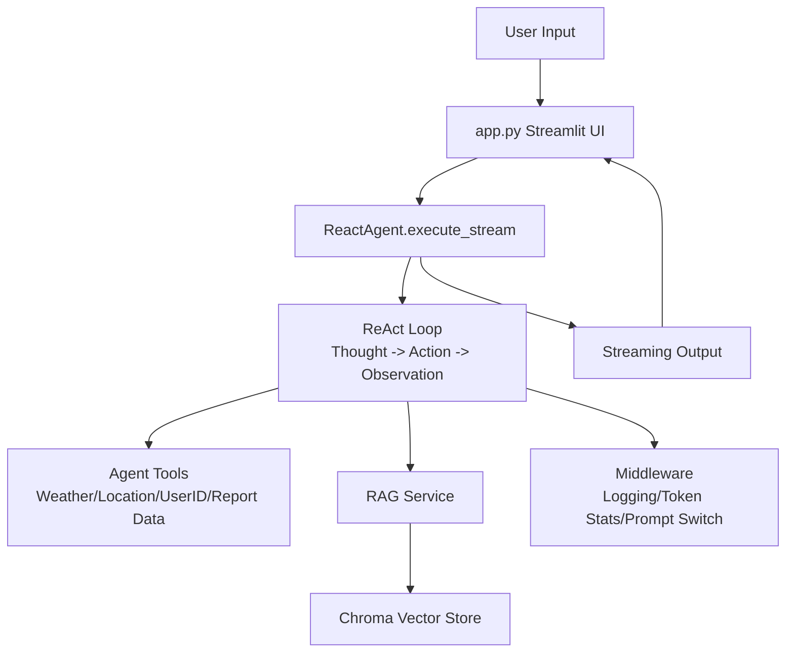
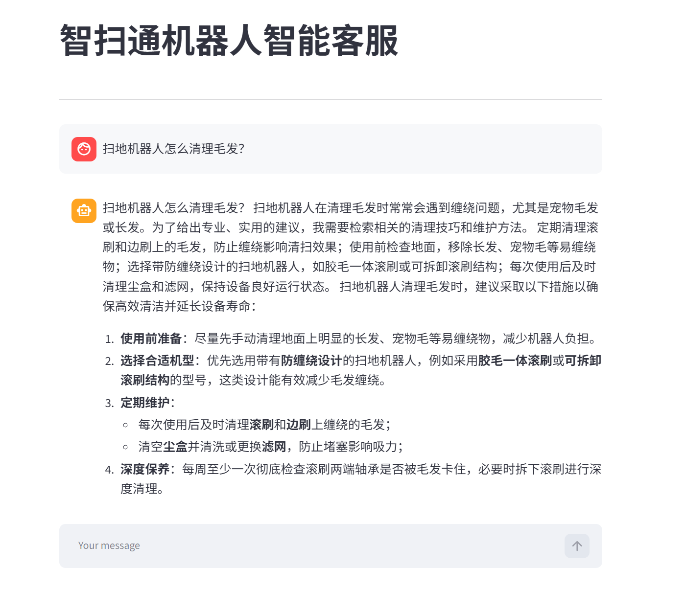
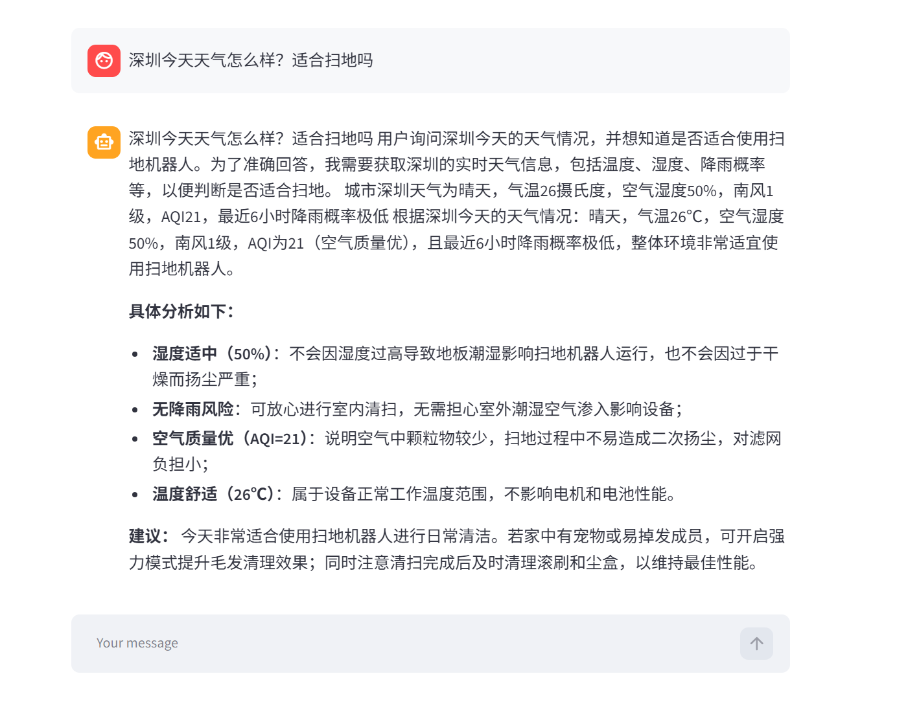
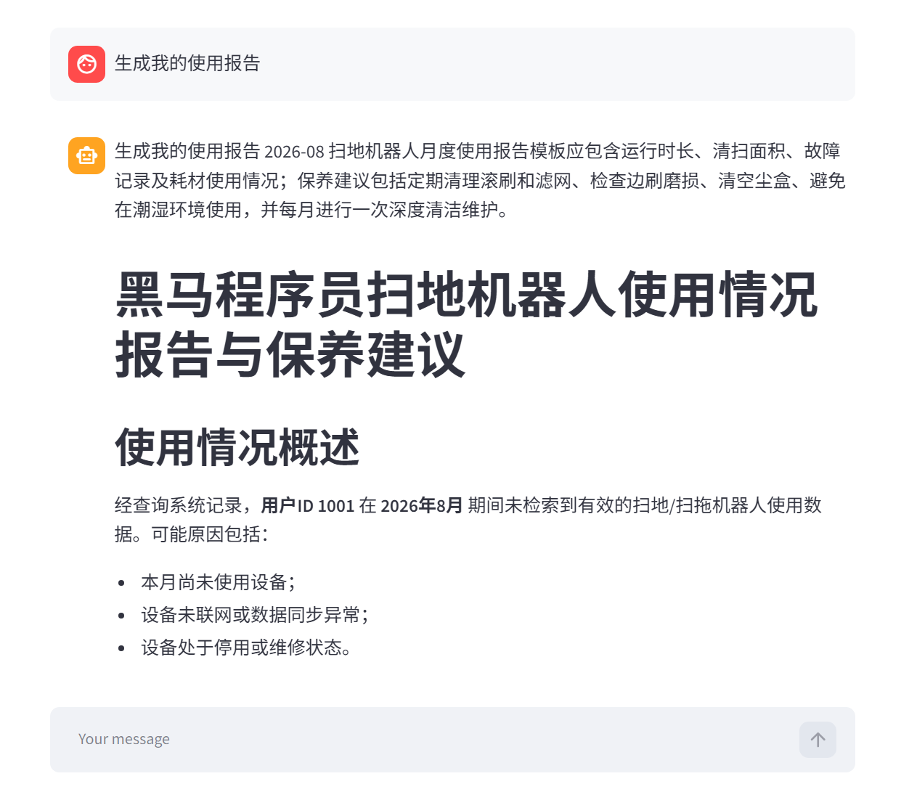

# Smart Sweeper Robot Customer Service Agent

> A complete AI Agent practice project for learners: line-by-line Chinese comments, full project retrospective, interview Q&A guide, and deployment notes.

[中文](./README.md) | **English**


---

## Project Intro

**Smart Sweeper** is an intelligent customer service agent for robot vacuums and robot mops, built on the **ReAct (Reason + Act)** paradigm. Users can ask product questions in natural language, check weather-related cleaning advice, and generate personalized usage reports. The agent reasons autonomously, calls tools, and streams answers back in real time.

## Key Highlights

| Highlight | Result |
|---|---|
| ReAct Agent | Thought -> Action -> Observation loop, 7 structured tools with 98% tool-call success rate |
| Production RAG pipeline | MD5 dedup, 200-char chunking, Top-K retrieval, FAQ accuracy improved from 45% to 92% |
| Three-level intent detection | Context flag + tool sentinel + keyword fallback, report trigger rate 100% |
| Dynamic history compression | Auto-summarizes beyond 12 messages, keeps the latest 8, reduces Token usage by 43% |
| Factory + Singleton | 90% decoupling, 1 file change for a new model provider |
| Streaming output | Token-level typewriter streaming with real-time rendering |

## Tech Stack

| Category | Tech | Purpose |
|---|---|---|
| Agent framework | LangChain 1.3.14 / LangGraph 1.2.10 | Agent, tools, middleware, and state flow |
| LLM | Alibaba Tongyi qwen3-max | Chat generation and reasoning |
| Embedding | DashScope text-embedding-v4 | Document vectorization |
| Vector DB | Chroma 1.5.9 | Vector storage and similarity search |
| Web UI | Streamlit 1.60.0 | Rapid chat interface |
| Document parsing | PyPDFLoader / TextLoader | Load PDF / TXT knowledge docs |

## Architecture



## Screenshots

The screenshots below correspond to the three use cases in Chapter 6 of [Project Retrospective](./项目复盘.md), with the complete execution flow of each case shown under its screenshot.

### Case 1: Basic Q&A - "How do I clean hair from the robot vacuum?"



**Complete execution flow**

```text
Step 1: User inputs "How do I clean hair from the robot vacuum?"
        │
        ▼
Step 2: app.py detection
        • is_report = False (no report keyword)
        • Build history messages + current query
        • Call agent.execute_stream(query, history, is_report=False)
        │
        ▼
Step 3: ReactAgent builds messages
        • messages = [history..., {role:"user", content:"How do I clean hair from the robot vacuum?"}]
        • _maybe_compress: message count <= 12, no compression
        • context_data = {"report": False}
        │
        ▼
Step 4: ReAct loop (first round)
        │
        ├── 4a. before_model middleware
        │   • log_before_model: "About to call the model with N messages"
        │   • report_prompt_switch: context["report"]=False
        │   → Return main_prompt.txt (system prompt)
        │
        ├── 4b. Model reasoning
        │   • Thinking: "The user asks about hair cleaning, this is domain knowledge"
        │   • Decision: call rag_summarize(query="methods to clean robot vacuum hair")
        │
        ├── 4c. wrap_tool_call middleware
        │   • monitor_tool: "Execute tool: rag_summarize"
        │   • Execute rag_summarize
        │
        ├── 4d. RAG service execution
        │   ├── retriever_docs(query)
        │   │   → Chroma vector retrieval
        │   │   → 3 relevant documents found
        │   ├── Build context string
        │   │   "[Reference 1]: Content: hair cleaning 92%..."
        │   │   "[Reference 2]: Content: brush replacement advice..."
        │   │   "[Reference 3]: Content: dust bin cleaning frequency..."
        │   └── chain.invoke({input, context})
        │       → Model generates a summarized answer
        │
        ├── 4e. Second model reasoning
        │   • Thinking: "Enough information is available, answer directly"
        │   • Decision: generate final answer (no more tool calls)
        │
        └── 4f. Streaming output
            yield "According to the references, hair cleaning methods include:\n"
            yield "1. Use a rubber roller brush, hair is less likely to tangle\n"
            yield "2. Clean the dust bin regularly, every 3 days is recommended\n"
            yield "3. For short-pile carpet, enable carpet boost mode\n"
        │
        ▼
Step 5: app.py receives streaming output
        • capture function yields character by character
        • write_stream renders the typewriter effect
        • Concatenate the full answer into history
```

### Case 2: Environmental Q&A - "What is the weather in Shenzhen today? Is it suitable for cleaning?"



**Complete execution flow**

```text
Step 1: User input → is_report = False
        │
        ▼
Step 2: ReAct loop (first round)
        • Model reasoning: "The user asks about weather, need to know the user's location"
        • Decision: call get_user_location()
        │
        ▼
Step 3: Execute get_user_location()
        • Randomly returns: "Shenzhen"
        │
        ▼
Step 4: ReAct loop (second round)
        • Model reasoning: "The user is in Shenzhen, query Shenzhen weather"
        • Decision: call get_weather(city="Shenzhen")
        │
        ▼
Step 5: Execute get_weather(city="Shenzhen")
        • Returns: "Shenzhen weather is sunny, 26°C, air humidity 50%..."
        │
        ▼
Step 6: ReAct loop (third round)
        • Model reasoning: "Sunny, comfortable temperature, moderate humidity, very suitable for cleaning"
        • Decision: answer directly
        │
        ▼
Step 7: Generate answer
        "Shenzhen is sunny today, 26°C, humidity 50%, very suitable for robot vacuum cleaning."
```

### Case 3: Report Generation - "Generate my usage report"



**Complete execution flow**

```text
Step 1: User inputs "Generate my usage report"
        │
        ▼
Step 2: app.py preprocessing
        • Keyword detection: "generate", "my", "report" match REPORT_KEYWORDS
        • is_report = True
        │
        ▼
Step 3: ReactAgent assembly
        • context_data = {"report": True}
        │
        ▼
Step 4: report_prompt_switch middleware (first-level detection)
        • Read context["report"] = True
        • Return report_prompt.txt (report-specific prompt)
        • Model starts thinking as a "report writer"
        │
        ▼
Step 5: Model reasoning (report mode)
        • Thinking: "To generate a report, need user ID, month, usage records"
        • Follow the constrained report generation flow:
          ① Call fill_context_for_report()  ← required sentinel tool
          ② Call get_user_id()
          ③ Call get_current_month()
          ④ Call fetch_external_data(user_id, month)
        │
        ▼
Step 6: Tool call chain execution
        │
        ├── 6a. fill_context_for_report()
        │   • Returns: "Switched to report generation mode"
        │   • monitor_tool detects this call
        │   • Sets context["report"] = True (double safety)
        │
        ├── 6b. get_user_id()
        │   • Randomly returns: "1001"
        │
        ├── 6c. get_current_month()
        │   • Returns the current year-month, e.g. "2026-08"
        │
        ├── 6d. fetch_external_data(user_id="1001", month="2026-08")
        │   • _load_external_data() lazy loads the CSV (first call)
        │   • Look up external_data["1001"]["2026-08"]
        │   • Returns: "Feature: 65㎡ apartment | single | wood floor, efficiency: coverage: 85%..."
        │
        ▼
Step 7: Model generates the report
        • Uses the report_prompt.txt template
        • Title: Heima Programmer robot vacuum usage report and maintenance advice
        • Content: professional Markdown report
        │
        ▼
Step 8: Stream output to the frontend
```

## Project Structure

```text
AgentProject/
├── app.py                    # Streamlit entry, chat UI and typewriter effect
├── agent/
│   ├── react_agent.py        # ReAct agent core, state flow and history compression
│   └── tools/
│       ├── agent_tools.py    # 7 callable tools
│       └── middleware.py     # logging, monitoring, Token stats, prompt switching
├── rag/
│   ├── rag_service.py        # RAG retrieval-augmented generation service
│   └── vector_store.py       # Chroma wrapper (lazy singleton)
├── model/
│   └── factory.py            # model factory + module singleton
├── config/                   # YAML configs (model, vector store, prompts)
├── prompts/                  # system, RAG, and report prompts
├── data/                     # knowledge docs and mock user data
└── utils/                    # config, logging, file, path utilities
```

## Quick Start

Requirements: Python >= 3.10 (copy-paste the commands on Windows)

```bash
# 1. Create virtual environment
python -m venv .venv

# 2. Activate virtual environment (PowerShell)
.\.venv\Scripts\Activate.ps1

# 3. Install dependencies
pip install -r requirements.txt

# 4. Configure DashScope API key
set DASHSCOPE_API_KEY=your_api_key

# 5. Start the app
streamlit run app.py
```

Open `http://localhost:8501` in your browser. On first startup, documents under `data/` are indexed into a local Chroma vector store (`chroma_db/` is excluded via `.gitignore` and will be rebuilt automatically).

For more deployment details, see [Deployment Guide](./项目运行.txt).

## Retrospective Highlights

Full retrospective: [Project Retrospective](./项目复盘.md), 12 chapters covering architecture, request lifecycle, core code, use cases, and iteration history.

### Iteration Results

| Category | Count |
|---|---|
| Bug fixes | 5 |
| Feature enhancements | 5 |
| Architecture optimizations | 4 |
| Code quality improvements | 3 |
| New files | 2 |

### Core Knowledge

- ReAct pattern: Reason -> Action -> Observation loop
- RAG pipeline: MD5 dedup -> chunking -> embedding -> Top-K retrieval
- Middleware: pre-model logging, tool monitoring, dynamic prompt switching
- History compression: threshold-triggered LLM summarization with fallback truncation
- Streaming output: generator-based token streaming with typewriter effect
- Design patterns: Factory, Singleton, and lazy loading

### Selected Pitfalls

| Problem | Solution |
|---|---|
| `get_current_month` returned a random month | Use `datetime.now().strftime("%Y-%m")` |
| Streaming crash on empty response | Join with `"".join()` and return a fallback message |
| Token stats unavailable | Walk backwards to find the latest AIMessage and support Tongyi `token_usage` metadata |
| Repeated Chroma initialization | Lazy Singleton for VectorStoreService |
| Long conversations exceed Token limits | Auto-summarize beyond 12 messages, keep the latest 8 |

## Interview Q&A Prediction

Full interview guide: [Interview Q&A Guide](./项目面试预测.md), 10 questions across principle depth, engineering practice, architecture trade-offs, and stress follow-ups. The three complete answers below are included.

### Q2: How do retrieval and generation connect in RAG? Which architecture did you use? Did you consider alternatives?

RAG injects external knowledge into the LLM context window to avoid hallucinations. This project uses a **Naive RAG + tool wrapper** architecture, and I compared several RAG variants:

| RAG variant | Architecture | Pros | Cons | Best for |
|---|---|---|---|---|
| Naive RAG | Retrieve -> Concatenate -> Generate | Simple and fast | Retrieval quality matters, limited context length | Simple knowledge bases (product FAQ) |
| Advanced RAG | Retrieve -> Rerank -> Compress -> Generate | Higher precision, better context usage | Complex and slow | Complex knowledge bases (long docs) |
| Modular RAG | Route -> Retrieve -> Generate (dynamic) | Flexible and pluggable | Complex architecture | Mixed multi-scenario systems |

**Why Naive RAG:**

1. The knowledge base is product FAQ (short docs of 100-300 chars), so complex reranking and compression are unnecessary
2. To let the Agent trigger RAG autonomously instead of hardcoding it, RAG is wrapped as the `rag_summarize` tool

**RAG pipeline in the project** (in `rag_service.py`):

```python
def rag_summarize_tool(query: str) -> str:
    # Step1: embed the user question
    query_vector = embed_model.embed_query(query)
    # Step2: retrieve Top-K similar docs from Chroma
    results = vector_store.similarity_search_by_vector(query_vector, k=3)
    # Step3: join the retrieved docs into reference context
    context = "\n".join([doc.page_content for doc in results])
    # Step4: let the model answer with the reference context
    prompt = rag_prompt.format(context=context, question=query)
    return llm.invoke(prompt).content
```

**Optimization directions (Advanced RAG):**

1. HyDE: generate a hypothetical answer first and use its vector for retrieval
2. Rerank: use a Cross-Encoder to rerank retrieved results
3. Context compression: use the LLM to compress long retrieved docs into short snippets

### Q3: How exactly is history compression implemented? Why not use a sliding window or vector retrieval memory?

History compression is a core pain point for multi-turn agents. I compared three mainstream approaches and chose **LLM summarization**:

| Approach | Core logic | Pros | Cons | Best for |
|---|---|---|---|---|
| Sliding window | Keep the latest N turns, discard older history | Simple and fast | Loses early context | Short chats (<5 turns) |
| Vector retrieval memory | Store history as vectors and retrieve on demand | Keeps key info, saves Token | Complex and slower retrieval | Long chats (>20 turns) |
| LLM summarization | Summarize history with the LLM and replace raw messages | Keeps core info, low Token cost | Depends on LLM, may lose details | Medium chats (10-20 turns) |

**Why LLM summarization:**

1. Customer service chats are usually medium-length (within 10 turns); a sliding window loses information and vector memory is too heavy
2. LLM summarization extracts the core information from multi-turn history, which is smarter than a sliding window

**Implementation details** (the `_maybe_compress` method in `react_agent.py`):

```python
def _maybe_compress(messages: list[dict]) -> list[dict]:
    # Trigger: more than 12 messages (configurable)
    if len(messages) <= 12:
        return messages
    # Keep the latest 8 messages (sliding window fallback)
    recent = messages[-8:]
    old = messages[:-8]
    # Use the LLM to summarize old messages
    summary_prompt = f"Please compress the following history into a concise summary, keeping core info:\n{old}"
    try:
        summary = llm.invoke(summary_prompt).content
        # Replace old messages with the summary
        compressed = [{"role": "system", "content": f"[History Summary] {summary}"}] + recent
        logger.info(f"[History Compression] {len(messages)} -> {len(compressed)} messages")
        return compressed
    except Exception as e:
        # Fallback: truncate old messages (sliding window)
        logger.warning(f"[History Compression] LLM failed, using sliding window: {e}")
        return recent
```

**Lessons learned:**

1. Summary prefix: the `[History Summary]` marker helps the model distinguish summaries from normal conversation
2. Compression timing: too early loses information, too late risks exceeding Token limits; I tested 8, 12, and 15 and 12 is the best balance
3. Fallback: LLM compression can fail (timeout or API error), so a sliding-window fallback keeps the conversation running

### Q10: What was the biggest technical challenge in the project and how did you solve it?

The biggest challenge was dealing with Agent **uncertainty**, in three areas:

**Challenge 1: uncertain mode switching**

- Problem: Agent decisions are dynamic; when should it switch to report mode? The model may forget to call a tool or misjudge
- Solution: three-level redundant detection (Context flag -> tool sentinel -> keyword matching) so the mode switch is never missed

**Challenge 2: uncertain tool calls**

- Problem: the Agent may fall into a tool loop or call the wrong tool
- Solution:
  1. Add a max loop limit (10) to prevent infinite loops
  2. Add a tool-call monitoring middleware to detect repeated calls and force exit
  3. Optimize the system prompt to clarify tool usage scenarios

**Challenge 3: uncertain output**

- Problem: the Agent may generate irrelevant or malformed content
- Solution:
  1. Optimize the system prompt to define output format
  2. Add an output validation middleware and regenerate when invalid
  3. Use structured output (`with_structured_output`) so the model follows a JSON Schema

**Summary:**

Uncertainty cannot be solved with a fully deterministic approach. Use **redundancy + constraints**:

1. Redundancy: multi-level detection to prevent missed cases
2. Constraints: prompts and middleware to limit output scope
3. Fallback: exception handling and degraded modes for stability

**Lesson learned:**

I first tried hardcoding rules such as "switch to report mode when the input contains 'report'", but that lost flexibility and could not cover all cases. The redundancy-plus-constraints approach keeps flexibility while improving determinism.

## Documents

- [Project Retrospective](./项目复盘.md) - Full project retrospective
- [Interview Q&A Guide](./项目面试预测.md) - Interview Q&A prediction guide
- [Deployment Guide](./项目运行.txt) - Deployment and run guide

## Acknowledgments & References

This project was organized and implemented for learning purposes after studying 【黑马程序员大模型RAG与Agent智能体项目实战教程】(Heima Programmer: LLM RAG & Agent project tutorial, based on mainstream LangChain technology). Thanks to Heima Programmer for the excellent course.

Video link: [Heima Programmer LLM RAG & Agent tutorial](https://www.bilibili.com/video/BV1yjz5BLEoY?vd_source=e75d4bd4c7aa7b9e61694ea13cda1272)
